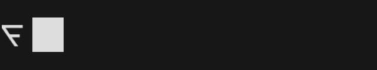
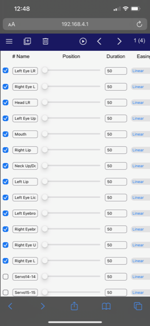
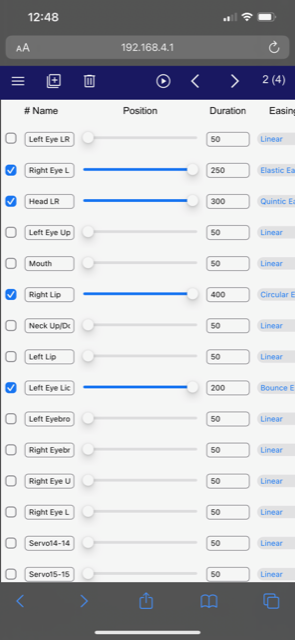

# Darth Servo

https://user-images.githubusercontent.com/16616950/217624012-ee10fa44-8614-4a1b-b24d-f9c56b16dc1c.mov

Animate 1 | Animate 2
:-: | :-:
 | 

## Installer

Install pre-built firmware directly onto your ESP board using this web based installer.
https://reeltwo.github.io/DarthServo-Installer/

Requires Chrome or Edge.

## Build using Arduino IDE

The firmware should build with esp32 board package 1.0.6 or 2.0.5. For ESP32S2 support 2.0.5 is required. Easiest option is to use the above installer to upload the filesystem and then compile and upload the sketch using the IDE. If you wish to modify and build the filesystem parititon you will need to follow these steps https://randomnerdtutorials.com/install-esp32-filesystem-uploader-arduino-ide/
(Not compatible with Arduino 2.0)

## Libraries Used

<ul>
<li>https://github.com/reeltwo/Reeltwo</li>
<li>https://github.com/rimim/espsoftwareserial</li>
</ul>

## Build using PlatformIO

PlatformIO will automatically download and install the ESP tools and necessary libraries.

Install VSCode https://code.visualstudio.com/

Install PlatformIO for VSCode https://platformio.org/install/ide?install=vscode

Select "File" / "Open Folder". Select DarthServo directory.

Select "Terminal" / "Run Task". Select "PlatformIO: Build (generic4MB)"

Select "Terminal" / "Run Task". Select "PlatformIO: Build Filesystem Image (generic4MB)"

Select "Terminal" / "Run Task". Select "PlatformIO: Upload Filesystem Image (generic4MB)"

Select "Terminal" / "Run Task". Select "PlatformIO: Upload"

## Build using command line tools (Mac)

Arduino.mk will automatically download and install the necessary libraries. You will need to install the ESP tools using the Arduino IDE Boards Manager as above.

    cd ~/Documents/Arduino
    curl -o Arduino.mk https://raw.githubusercontent.com/reeltwo/Arduino/master/Arduino.mk
    # Fetch repository
    git clone https://github.com/reeltwo/DarthServo
    # Enter directory
    cd DarthServo
    # Build firmware for a generic 16MB ESP32
    make
    # Build firmware for a generic 4MB ESP32
    make 4MB=1
    # Build firmware for Penumbra board
    make PENUMBRA=1
    # Build firwmare for Amidala board (without touch screen)
    make TARGET=ESP32S3
    # Build firwmare for Amidala board (with touch screen)
    make TARGET=ESP32S3 TOUCH=1
    # Build firmware for Yoda board
    make BACKPACK=1

## Build using command line tools (Linux)

Arduino.mk will automatically download and install the necessary libraries. You will need to install the ESP tools using the Arduino IDE Boards Manager as above.

    cd ~/Arduino
    wget https://raw.githubusercontent.com/reeltwo/Arduino/master/Arduino.mk
    # Fetch repository
    git clone  https://github.com/reeltwo/DarthServo
    # Enter directory
    cd DarthServo
    # Build firmware for a generic 16MB ESP32
    make
    # Build firmware for a generic 4MB ESP32
    make 4MB=1
    # Build firmware for Penumbra board
    make PENUMBRA=1
    # Build firwmare for Amidala board (without touch screen)
    make TARGET=ESP32S3
    # Build firwmare for Amidala board (with touch screen)
    make TARGET=ESP32S3 TOUCH=1
    # Build firmware for Yoda board
    make BACKPACK=1

## Requirements for rebuilding JavaScript/HTML content

<ul>
<li>Install Python3 (https://www.python.org/downloads/)</li>
<li>Install npm (https://nodejs.org/en/download/)</li>
<li>pip3 install fontTools</li>
<li>pip3 install brotli</li>
</ul>
